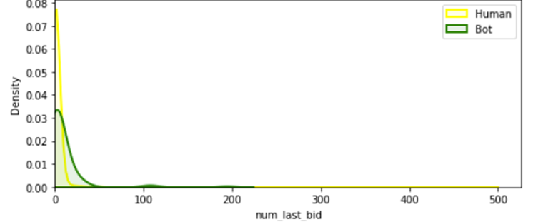
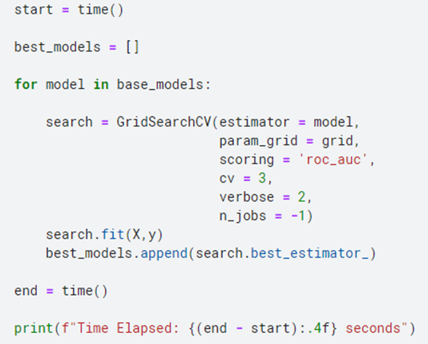

# Facebook: Human or Robot ?

This repository contains my team's solution to the **Facebook Recruiting IV: Human or Bot** competition hosted on
[Kaggle](https://www.kaggle.com/competitions/facebook-recruiting-iv-human-or-bot).

**組員：**
練 O 剛、常 O 利、林 O 宏

## 競賽內容

網站上的人類競標者因無法贏得「機器人」的拍賣而變得越來越沮喪，導致核心客戶群的使用量下降。目標是識別出「機器人」提出的線上拍賣出價，幫助網站所有者標記這些用戶，以防止不公平的拍賣活動。文件將根據 ROC 曲線下的面積進行評分。

## 比賽資料集

### Bidder dataset:

- bidder_id: bidder 的唯一 ID
- payment_account: bidder 的付款帳戶
- address: bidder 的郵件地址
- outcome: bidder 的 label，0 代表人類，1 代表機器人

### Bid dataset:

- bid_id: bid 的唯一 ID
- bidder_id: bidder 的唯一 ID (與 bidder dataset 相同)
- auction: 拍賣的唯一 ID
- merchandise: 拍賣網站廣告系列的類別
- device: 手機型號
- time: 出價時間
- country: bidder IP 所屬的國家
- ip: bidder 的 IP
- url: 紀錄 bidder 從哪個網址跳轉到當前的競拍頁面

## 特徵工程

1. 統計每個 bidder_id 所擁有的各項資料
2. bidder 在每次 bid 之間的時間間隔
3. 平均值、中位數、最小值、最大值
4. 一個 bidder_id 有幾次的最先出價和最後出價

   
   

5. 在最後一段時間出價的出價次數

   

6. 一個 bidder_id 的出價次數最大值

   

7. 在不同的裝置上的出價次數

   

8. 同一個 bidder 出價不同的商品

   

## 模型: Random Forest

Random Forest 是由許多不同的決策樹組成的一個分類器，結合多個弱分類器以建構一個更強分類器。我們選擇使用 Random Forest 模型來訓練，以處理此競賽的二分類問題，並使用過取樣器來處理不平衡的資料。

## 模型架構

1. 初始化五個 Random Forest 分類器 `rf1` 到 `rf5` 和一個過取樣器 `RandomOverSampler`
2. 將過取樣器與每個 Random Forest 模型結合，建立五個帶有過取樣步驟的 Random Forest 模型 `pp1` 到 `pp5`

   

3. 我們編寫了一個用於交叉驗證的函式。此函式在資料集上進行了多次交叉驗證，用於評估模型的性能
   
4. 再來我們建立了一個用來微調參數的 `grid`，其中包含 Random foreset 模型的不同參數組合

5. 透過 `GridSearchCV` 在不同的參數組合上進行訓練和調優

## 最後結果

我們繪製了 ROC AUC 分數的分佈，以比較整合平均和參數調整前後的差異。

## Private Score & Public Score

